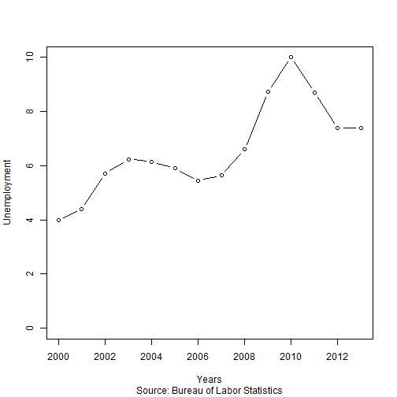

## Introduction

* The US Unemployment by State shiny application is an application that helps you visualize US unemployment data by state.
* Very simple and easy to use.
* Doesn't require specialized knowledge.
* No need to program.
* No need to install any programs or packages on your computer.

--- .class #id 

## How it Works

* All you need to do is access the application on-line at the link below. 
https://datavoyager.shinyapps.io/PeerReview/

* The source files and data for the application can be found at the following link.
https://github.com/datavoyagr/DataProducts

* Annual average statewide unemployment data used by this app was gathered from the Bureau of Labor Statistics http://www.bls.gov/lau/#cntyaa

* The data was combined into one table that includes data for the years 2000-2013.

* This application takes the information provided by the user and generates a plot of unemployment data by states and years. 

---

## How to Use it
### Once you launch the application:

1. Use the slider in the left panel of the screen to select the range of years of unemployment data you would like to plot.

2. Use the drop down menu to select the states for which you would like to plot unemployment data. 

3. You can select as many states as you would like. You can also remove any state from the plot by simply clicking on the state you would like to remove and deleting it with the delete key on your computer.


---

## What it Does

Below is an example of the type of plot generated by this application.


```r
plot(unemploy$year[unemploy$state=='OHIO'], unemploy$unemployment[unemploy$state=='OHIO'],
  xlab='Years', ylab='Unemployment', sub="Source: Bureau of Labor Statistics",
  xlim=c(2000, 2013), ylim=c(0, 10),type="b")
```

 


